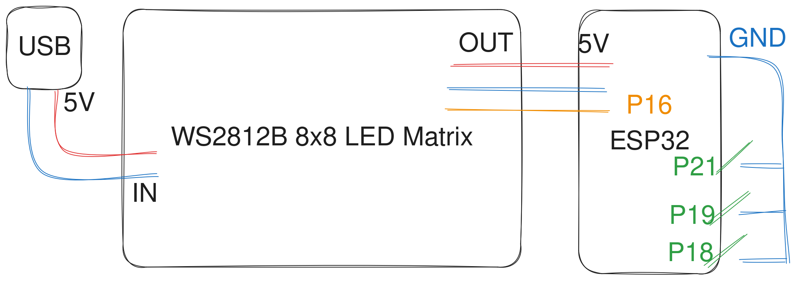

# Esp32-Pomodoro-Timer

A DIY pomoro timer with an ESP32 and WS2812B LED matrix, programmed with the Adafruit NeoMatrix library.

As I'm not an embedded/IoT programmer and this was just a spare time side project, the code isn't the greatest, but it works... :)

